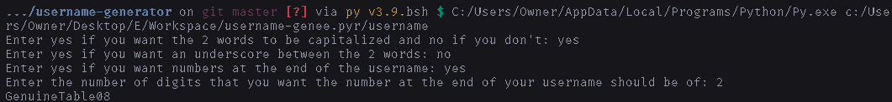

# How to use

1. Install [python](https://python.org/downloads).
2. Download the files [`english-adjectives.txt`](https://raw.githubusercontent.com/DhruvMitna/username-generator/master/english-adjectives.txt), [`english-nouns.txt`](https://raw.githubusercontent.com/DhruvMitna/username-generator/master/english-adjectives.txt) and [`username.py`].
3. Open your downloads folder and open `username.py` (If you are prompted to select an app to open the file, select python and click ok).

### An example

